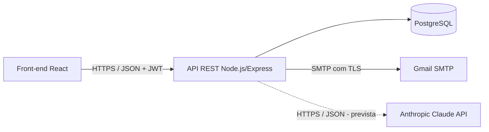
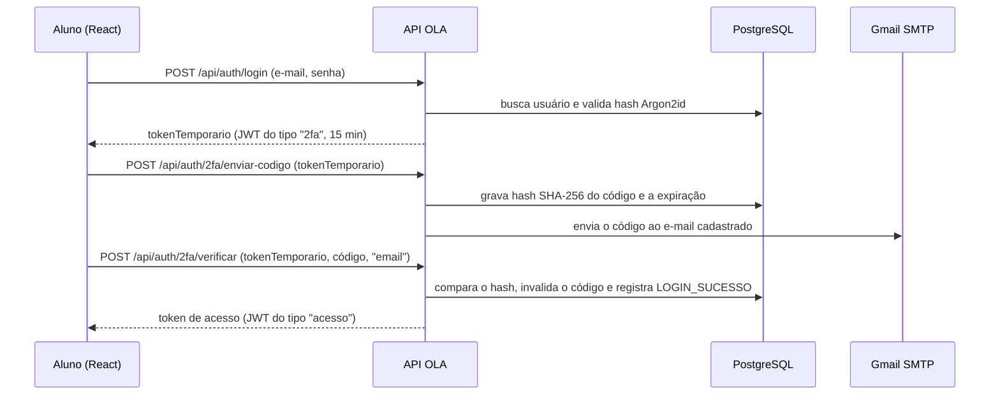
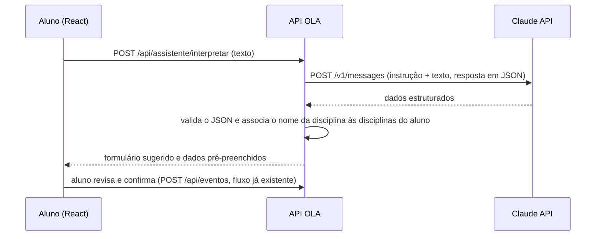

# Integração com API externa — projeto lógico e documentação

## 1. Visão geral

O OLA depende de dois serviços externos, ambos consumidos exclusivamente pelo
back-end (Node.js/Express). O front-end nunca recebe credenciais desses serviços.

| Serviço | Situação | Finalidade |
|---|---|---|
| Envio de e-mail (SMTP do Gmail via Nodemailer) | Implementado | Código da verificação em duas etapas, código de recuperação de senha e e-mail de boas-vindas |
| API de IA (Anthropic Claude — Messages API) | Prevista (funcionalidade complementar, prioridade 4 da Ficha) | Interpretar uma frase do aluno e pré-preencher o formulário correspondente |

A integração de e-mail foi reaproveitada do projeto de autenticação desenvolvido
anteriormente (MVP). O login social com Google OAuth 2.0, que existia no MVP, não foi
mantido: não faz parte das telas do protótipo, não consta na Ficha de caracterização
(que define a API de IA como única dependência externa além da hospedagem) e exigiria
credenciais adicionais do Google Cloud.

## 2. Serviço de e-mail (implementado)

| Item | Definição |
|---|---|
| Módulo | `backend/src/services/emailService.ts` |
| Biblioteca | Nodemailer, com o serviço pré-configurado `gmail` (SMTP com TLS) |
| Autenticação | Conta Gmail e senha de app, lidas das variáveis `GMAIL_USER` e `GMAIL_APP_PASSWORD` |
| Formato | E-mail HTML com a identidade visual do OLA |
| Dados enviados | E-mail do destinatário, nome de usuário e, quando aplicável, o código de 6 dígitos. Senhas nunca são enviadas |

### Mensagens

| Função | Quando é enviada | Conteúdo |
|---|---|---|
| `enviarBoasVindas` | Após o cadastro | Confirmação da criação da conta |
| `enviarCodigo2fa` | Quando o aluno escolhe receber o código de verificação por e-mail | Código de 6 dígitos, válido por 15 minutos |
| `enviarCodigoRecuperacao` | Na etapa 1 da redefinição de senha | Código de 6 dígitos, válido por 15 minutos |

### Fluxo — verificação em duas etapas por e-mail

### Regras e tratamento de falhas

- Os códigos são gerados com gerador criptograficamente seguro, armazenados somente como
  hash SHA-256, expiram em 15 minutos e são invalidados após o uso.
- O envio é feito em segundo plano: uma falha do provedor é registrada no console do
  servidor e não interrompe a requisição do aluno.
- Sem `GMAIL_USER`/`GMAIL_APP_PASSWORD` em ambiente de desenvolvimento, o e-mail é
  simulado e o código aparece no console do back-end. Nos testes automatizados nenhum
  e-mail é enviado.
- Limites de envio da própria API (por IP, janela de 15 minutos): 3 envios de código de
  verificação e 3 solicitações de recuperação de senha.
- O Gmail aplica limites diários de envio para contas comuns; para uso em produção em
  larga escala seria necessário um provedor transacional.

## 3. API de IA (prevista — funcionalidade complementar)

Projeto lógico da funcionalidade "assistente de preenchimento via chat" descrita na
Ficha de caracterização. Ainda não implementada nesta entrega.

| Item | Definição |
|---|---|
| Endpoint externo | `POST https://api.anthropic.com/v1/messages` |
| Autenticação | Cabeçalhos `x-api-key` (variável `ANTHROPIC_API_KEY`, somente no back-end), `anthropic-version: 2023-06-01` e `content-type: application/json` |
| Modelo | Definido em variável de ambiente (`ANTHROPIC_MODEL`) |
| Endpoint interno proposto | `POST /api/assistente/interpretar` — protegido por JWT, corpo `{ "texto": "prova de Cálculo dia 10/09, peso 3" }` |
| Resposta interna proposta | `{ "formulario": "evento", "dados": { "titulo": "Prova", "tipo": "PROVA", "data": "2026-09-10", "peso": 3, "disciplina": "Cálculo" } }` |
| Dados enviados ao provedor | Somente o texto digitado pelo aluno naquele momento. Senha, e-mail e demais registros não são enviados |

Regras previstas:

- O resultado apenas pré-preenche o formulário; nada é salvo sem a confirmação do aluno,
  e o registro usa as rotas e validações já existentes.
- Indisponibilidade, tempo de resposta excedido ou resposta inválida do provedor geram a
  mensagem "Assistente indisponível no momento. Preencha o formulário manualmente.",
  sem impedir o cadastro manual.
- Limites de uso e custos por token seguem a política do provedor
  (<https://platform.claude.com/docs/en/api/overview>).
- Antes de ativar a funcionalidade, os Termos de Uso e a Política de Privacidade devem ser
  atualizados para informar o envio do texto a um operador externo.
